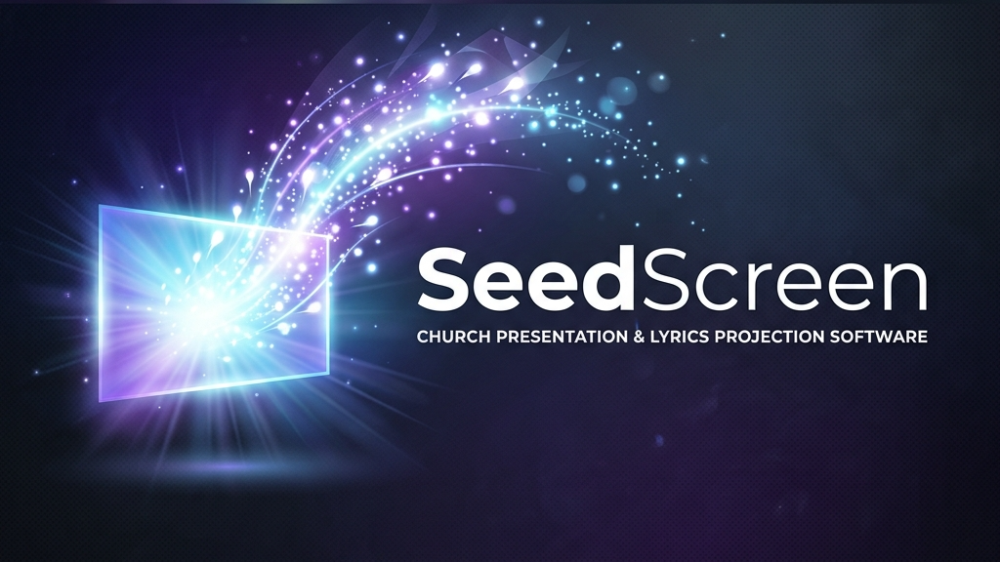

<div align="center">
  

  <br />
  <br />

  **A modern, sleek, and powerful presentation software for churches and live events.**

  [](https://reactjs.org/)
  [](https://www.electronjs.org/)
  [](https://www.typescriptlang.org/)
  [](https://tailwindcss.com/)
  [](https://sqlite.org/)
</div>

<br />

## 📖 Table of Contents

- [🌟 What is SeedScreen?](#-what-is-seedscreen)
- [✨ Key Features](#-key-features)
- [🛠️ Technologies Used](#️-technologies-used)
- [🚀 Quick Start Guide](#-quick-start-guide)
  - [Prerequisites](#prerequisites)
  - [Installation](#installation)
  - [Development Environment](#development-environment)
  - [Build and Production](#build-and-production)
- [🤝 Contributing](#-contributing)
- [📜 License](#-license)

## 🌟 What is SeedScreen?

**SeedScreen** is a next-generation presentation software designed specifically for worship environments, live events, and conferences. Built on a modern technology stack (React, Vite, Electron), it delivers a seamless, fast, and visually stunning experience.

Forget outdated interfaces. SeedScreen provides a top-tier dark-themed control panel and a frameless projection window designed to captivate your audience.

## ✨ Key Features

*   **Professional Lyrics and Media Projection:** Instantly send song lyrics, images, and high-quality videos to a secondary display.
*   **Bible Integration:** Quick search and projection of Bible verses with support for multiple books and chapters.
*   **Advanced Song Manager:** Ultra-fast local database (SQLite) to store your repertoire.
    *   🤖 *AI-assisted song generation and import.*
    *   🌍 *Real-time automatic song translation.*
*   **Web Remote Control:** Control your presentation right from your mobile phone or any other device on the same local network (LAN).
*   **P2P Synchronization:** Find other devices running SeedScreen on your network and effortlessly sync your song database.
*   **Total Customization:**
    *   Live backgrounds, static images, and solid colors or gradients.
    *   Support for church/event logos.
    *   Highly adjustable text styles for maximum readability.

## 🛠️ Technologies Used

*   **Frontend:** React 18, TypeScript, Vite.
*   **Styling & UI:** Tailwind CSS v4, Shadcn UI, Base UI, Lucide React (iconography).
*   **Desktop:** Electron (with multi-display support and an always-on-top projection window).
*   **Local Database:** `better-sqlite3` paired with `drizzle-orm` for secure and efficient transactions.
*   **Others:** QR code generation for the remote control and an advanced IPC system for inter-process communication.

## 🚀 Quick Start Guide

### Prerequisites

Ensure you have [Node.js](https://nodejs.org/) (LTS version recommended) and `npm` installed on your system.

### Installation

1.  Clone this repository.
2.  Navigate to the project directory:
    ```bash
    cd seedscreen
    ```
3.  Install dependencies:
    ```bash
    npm install
    ```

### Development Environment

To start the application in development mode with HMR (Hot Module Replacement) enabled:

```bash
npm run dev
```

This will open the SeedScreen control window and compile the app locally.

### Build and Production

To generate the final package for your operating system:

```bash
npm run build
```

Executables and installers will be generated in the `release/` folder (or according to your `electron-builder.json5` configuration).

## 🤝 Contributing

Contributions, issue reports, and feature requests are welcome! Feel free to check the issues page if you'd like to collaborate on the SeedScreen codebase.

## 📜 License

This project is released under the **SeedScreen Non-Commercial License**.

You are free to use, modify, and distribute the software, provided that you **do not use it for commercial purposes** (no revenue generation) and you **always provide attribution** to the original SeedScreen project.

See the [LICENSE](LICENSE) file for more details.
